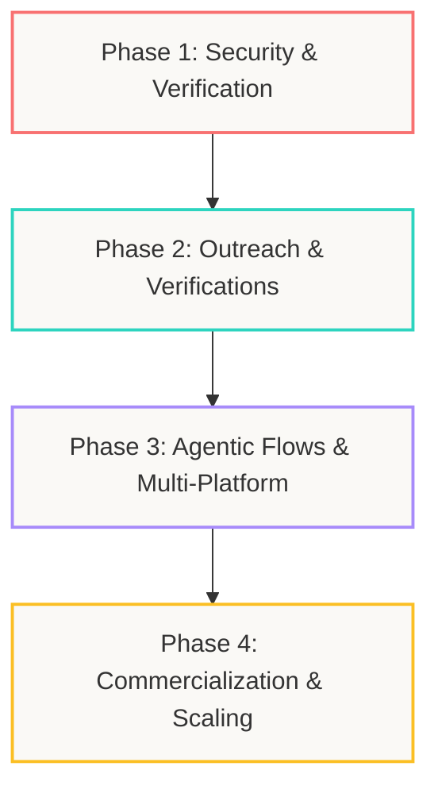

# Creator Scout AI - Product Roadmap

## 1. Executive Summary & Product Vision

Creator Scout AI is an intelligent creator matching platform designed for DTC (Direct-to-Consumer) and SMB (Small and Medium-Business) brands. Unlike traditional database-centric platforms (e.g., Modash, HypeAuditor) that rely on flat filtering and high licensing fees, Creator Scout AI begins with **brand intelligence**. 

```
Brand URL ➔ Brand Brief Extraction ➔ Ideal Creator Hypotheses ➔ Evidence-Backed Matching ➔ Compliant Contact Enrichment ➔ AI Pitch Drafting ➔ CRM Board Lifecycle
```

The primary positioning is **"Explainable AI Creator Scouting"**—answering not just *who* are the creators, but *why* they fit the brand, *what* specific product focus fits them, and *how* to draft personalized outreach compliant with spam regulations.

---

## 2. Current Product Architecture & State

The product currently consists of a Next.js frontend, a multi-threaded Python API server, a separate asynchronous Python worker process, and an InsForge backend.

### 2.1 Technology Stack & Design System
* **Frontend**: Next.js App Router (React 19, Tailwind CSS 4, Framer Motion) using the custom **"Sticker Notebook"** design system (warm cream `#faf9f6` paper backgrounds, sticker cards, badge stickers, Caveat handwriting accents, and smooth entrance transitions).
* **Backend Database & Storage**: InsForge Postgres BaaS (PostgREST endpoints, private Storage buckets for CSV exports, row-level security).
* **AI & Completions**: InsForge AI Gateway (completions for Brand Brief, Creator Scoring, and Outreach Drafting; embeddings for semantic search).
* **Ingestion Adapters**: Official YouTube Data API for channel discovery and hydration; TinyFish for explicit search/fetch url enrichment; Firecrawl and public web scrapers for compliant URL refreshes.

### 2.2 Implemented Core Features
* **Brand Scanning**: Crawls a brand website using a custom robots-compliant crawler, extracts category/USP/customer brief, and generates target search queries.
* **Creator Discovery**: Spawns async queries executed by the YouTube or TinyFish adapter.
* **Resilient Ingestion**: Clamps large numbers to avoid PostgREST cache integer overflows, logs errors gracefully per-creator, and indexes channel evidence.
* **Fit Scoring**: Automatically evaluates and segments candidates into practical action buckets (`contact_first`, `review`, `backup`, `avoid`).
* **CRM Board & CSV Export**: Persists status tags (`shortlisted`, `contacted`, `negotiating`, etc.), edits notes, and exports CSV shortlists stored inside the private `campaign-exports` storage bucket.
* **AI Outreach Drafts**: Generates context-aware, highly personalized pitches.

---

## 3. Identified Gaps & Operational Vulnerabilities

While the foundational pipeline works, the following items must be resolved to transition from an MVP to a production-grade SaaS.

### 3.1 Compliance & Delivery Gaps in Outreach
* **Drafts vs. Send**: While outreach pitch drafts are generated, actual emailing lacks bounce handling, suppression lists, and compliance controls.
* **Suppressions**: The database has no active suppression tracking to guarantee that a creator marked `do_not_contact` or one who unsubscribed is never emailed.
* **Email Sender Domain Verification**: Need DNS/SMTP verification workflows to prevent pitches from being flagged as spam.

### 3.2 System Architecture & Scalability Gaps
* **Managed Compute**: The worker process runs locally as a python loop; it has Docker configuration but is not deployed to InsForge's managed compute server.
* **Rate Limits**: The app lacks rate limiting for external providers (YouTube quota, TinyFish credits, OpenAI/Anthropic RPM), exposing the app to downtime or unexpected cost spikes.
* **Agent Orchestration**: Multi-agent workflows are defined in specs but implemented as deterministic python services. Transitioning to LangGraph would allow checkpointing, detailed traces, and user approval gates.

### 3.3 Commercial & Product Gaps
* **Subscriptions & Billing**: Dodo Payments and Stripe integrations are defined in the technical spec but not yet wired to active UI checkouts or webhook listeners.
* **Multi-User/Tenant scoping**: Need organizations and access control checks (using Kinde or custom JWT claims) to ensure users only access their brand workspace.
* **Platform Constraints**: Scrapers for Instagram, TikTok, and LinkedIn are disabled due to strict terms. Search filters exist but rely on cached database profiles.

---

## 4. Phased Implementation Roadmap

To scale Creator Scout AI into a commercial, compliance-first, and multi-channel product, the engineering and product team should follow this four-phase plan.



### 🔴 Phase 1: Security Hardening & Smoke Verification (Weeks 1-2)
* **Hardening Merge**: Merge and verify the `mvp-hardening` InsForge branch to enforce RLS (Row-Level Security) policies and revoke broad grants on `anon`/`authenticated` table accesses.
* **Credential Isolation**: Complete migration of all Python server API and worker operations to use `INSFORGE_API_KEY` and `INSFORGE_API_BASE_URL` exclusively, deprecating the use of the client-side anon keys.
* **Workspace Cleanups**: Implement automated test suite cleanups and fix rate-limiting issues on local developer runs.

### 🟢 Phase 2: Compliant Outreach & Data Enrichment (Weeks 3-5)
* **Transactional SMTP & AutoSend Integration**: Configure SMTP settings and write AutoSend hooks to dispatch welcome, brief-ready, and shortlist-ready notifications.
* **Consent & Suppression Workflows**: Implement a database suppression table mapping unsubscribes, bounces, and complaints. Inject `X-Unsubscribe` headers in outgoing pitches.
* **Contact Verification Engine**: Integrate third-party verification filters to confirm public email validity before exposing them in the CRM.
* **Email Sender Domain Integration**: Add support for Gmail OAuth/Outlook connection so founders can send pitches directly from their personal domain.

### 🟣 Phase 3: Agentic Graph Orchestration & Multi-Platform Search (Weeks 6-8)
* **LangGraph Migration**: Implement the multi-agent graph with deterministic nodes for brand analysis, query planning, and candidate vetting. Add human-in-the-loop approval gates before shortlist generation.
* **Exa & Tavily Search Integration**: Integrate search APIs as additional crawl and discovery providers to find media kits, blogs, and niche portfolios.
* **Platform UI Improvements**: Build out localized search capabilities (target languages, cities, and specific regions) in the Campaign Launch screen.
* **B2B Organization Scoping**: Support workspaces, roles, and invite-links using tenant JWT claims.

### 🟡 Phase 4: Commercialization, Rate Limiting & Scaling (Weeks 9-12)
* **Dodo Payments Integration**: Deploy pricing tables, checkout redirection, and webhook signature handlers for subscription upgrades.
* **Managed Worker Deployments**: Deploy worker processes to managed compute (such as Fly.io or InsForge compute container) with scale-to-zero capabilities.
* **Redis Rate Limiting**: Limit quotas per user/org for external APIs (YouTube, TinyFish, OpenAI) to prevent runaway costs.
* **Attribution Workflows**: Introduce tracking links and promo codes inside outreach briefs to help brands measure sales and engagement ROI in the CRM.
